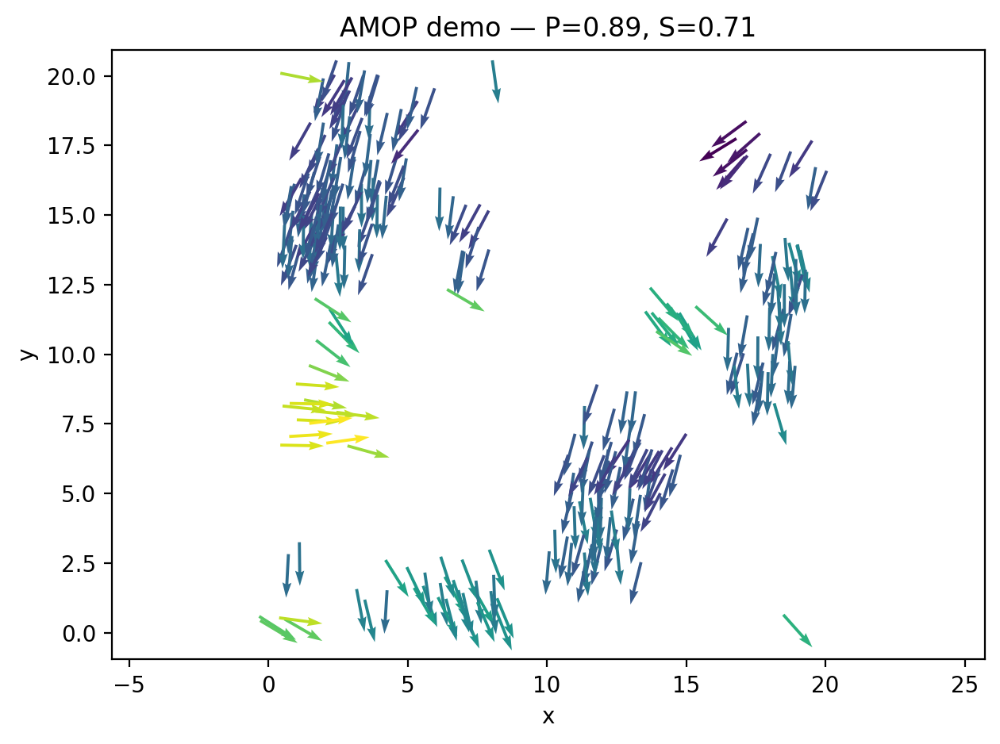
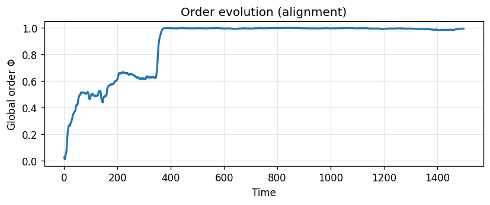
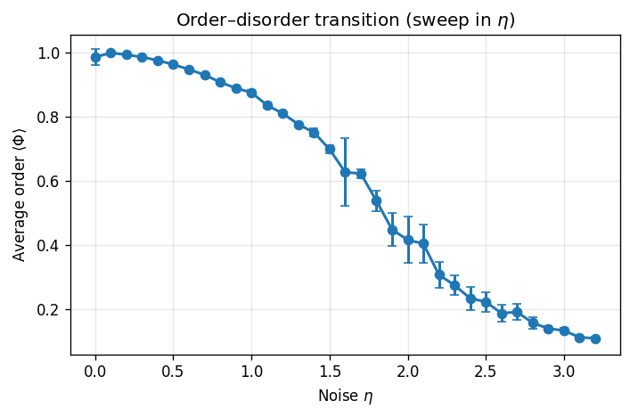
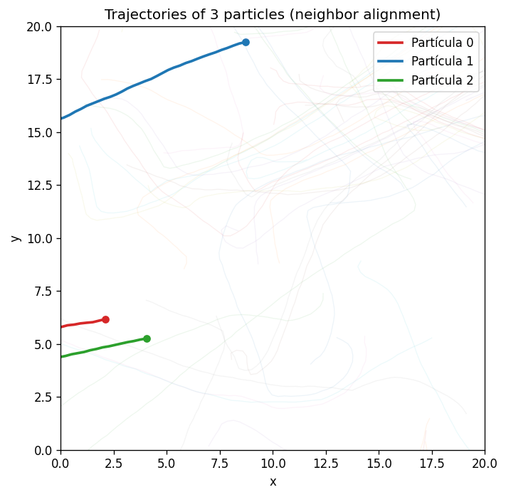

# AMOP — Active Matter & Optical Physics Sandbox

Collection of minimal, well-commented codes for **Atomic, Molecular, and Optical Physics (AMOP)** and **Active Matter**.  
This repo currently includes a Vicsek-type alignment model for self-propelled particles and utilities to visualize order formation, trajectories, and the order–disorder transition.

> **Why this repo?** Reproducible, didactic scripts that bridge physics ideas (light–matter, collective motion, symmetry/geometry) with clean numerical experiments and publication-grade figures.

---

## Contents

- [Overview](#overview)
- [Key ideas](#key-ideas)
- [Results & Figures](#results--figures)
  - [A. Vicsek-type alignment (animation)](#a-vicsek-type-alignment-animation)
  - [B. Time evolution of global order Φ](#b-time-evolution-of-global-order-φ)
  - [C. Order–disorder transition vs noise η](#c-orderdisorder-transition-vs-noise-η)
  - [D. Example trajectories](#d-example-trajectories)
- [Reproduce the figures](#reproduce-the-figures)
- [Parameters & model](#parameters--model)
- [Project structure](#project-structure)
- [Reproducibility notes (per figure)](#reproducibility-notes-per-figure)
- [Limitations & edge cases](#limitations--edge-cases)
- [Why this is relevant for MtL-URO](#why-this-is-relevant-for-mtl-uro)
- [Example console log](#example-console-log)
- [Tests & minimal CI](#tests--minimal-ci)
- [Cite & references](#cite--references)
- [License](#license)

---

## Overview

We simulate \(N\) self-propelled particles with constant speed \(v\) in a 2D periodic box.  
At each step, each particle aligns to the **average heading of neighbors** within radius \(R\), plus angular noise of amplitude \(\eta\).  
The global **order parameter** is

$$
\Phi(t)=\frac{1}{N}\left\lVert \sum_{i=1}^{N}\mathbf{v}_i(t)\right\rVert \big/ v,
$$

so \(\Phi \in [0,1]\) measures alignment (1 = full order, 0 = disorder).

---

## Key ideas

- **Local rules → global order.** Increasing neighborhood alignment and reducing noise drives a non-equilibrium phase transition to collective motion.
- **Order parameter \(\Phi\).** A compact scalar that diagnoses the degree of flocking.
- **Noise sweep.** Averaging \(\Phi\) over time and seeds across \(\eta\) reveals the order–disorder curve and fluctuations near the transition.
- **Trajectories.** Pathlines clarify kinematics beyond \(\Phi\) (clustering, banding, persistence).

---

## Results & Figures

**Example snapshot.** Final configuration of an active particle system (Vicsek-type). Each arrow is a particle’s position and orientation.  
**Example values:** \(P \approx 0.89\) (polarization), \(S \approx 0.71\) (2D nematic order).



### A. Vicsek-type alignment (animation)


**What to look for.** Random headings at start, then rapid coarsening into a coherently moving cluster.  
**Interpretation.** For fixed \((N, v, R)\) and moderate noise \((\eta)\), the system self-organizes: headings synchronize and center-of-mass drift emerges.

---

### B. Time evolution of global order \(\Phi\)



**Caption.** \(\Phi(t)\) rises from near 0 to \(\approx 1\) and then fluctuates weakly around a plateau.  
**Takeaway.** Transient alignment gives way to a steady ordered phase; the time-to-plateau shrinks when \(\eta\) is smaller or density is larger.

---

### C. Order–disorder transition vs noise \(\eta\)



**Caption.** Long-time average \(\langle \Phi \rangle\) vs noise amplitude \(\eta\). Markers show the mean over seeds; error bars show sample variability.  
**Takeaway.** Clear monotonic loss of order with noise. The knee indicates the transition region; error bars grow near criticality (enhanced fluctuations).

---

### D. Example trajectories



**Caption.** Trajectories of three tagged particles (colored), drawn over faded tracks of the rest.  
**Takeaway.** Persistent, nearly parallel motion in the ordered phase; curvature and scattering increase as \(\eta\) rises.

---

## Reproduce the figures

```bash
# 1) Create environment (Python ≥3.10 recommended)
python -m venv .venv
# Windows:
#   .venv\Scripts ctivate
# macOS/Linux:
#   source .venv/bin/activate
pip install -r requirements.txt

# 2) (Option A) Reproduce everything
python run_all.py

# 2) (Option B) Generate specific artifacts

# 2.1) Example snapshot (creates figures/amop_demo_*.png)
python demo.py
# or:
python -m examples.run_example

# 2.2) Vicsek animation
python vicsek_alignment.py --save figures/anim_vicsek.gif

# 2.3) Order–disorder curve Φ(η)
python phi_vs_eta.py --out figures/phi_vs_eta.png
```

Outputs are written to `figures/` (and `results/` when applicable).  
Use `run_all.py --only <task>` or `--skip <task>` to filter tasks.

---

## Parameters & model

- \(N\): number of particles  
- \(L\): box size (periodic \(L\times L\))  
- \(v\): constant speed (step size per iteration)  
- \(R\): interaction radius (metric neighbors)  
- \(\eta\): uniform angular noise in \([ -\eta/2,\ \eta/2 ]\)  
- **Update rule:** each particle takes the **mean orientation** of neighbors within \(R\), then adds noise, then moves a step of length \(v\).
- **Boundary condition:** periodic; positions wrap via minimum-image convention.
- **Reproducibility:** set a seed via `amop.set_seed(seed)` or pass `seed=` to simulation helpers.

---

## Project structure

```
amop/                 # Core package
  ├── simulate.py     # Vicsek-type simulation in 2D
  ├── order_params.py # Polarization and nematic order (2D)
  ├── bootstrap.py    # RNG seeding / global generator
  └── __init__.py     # Public API (re-exports)

examples/
  └── run_example.py  # Minimal demo that produces a snapshot figure

tests/                # Minimal test suite
figures/              # Generated figures and animations
run_all.py            # Orchestrates all reproducible artifacts
vicsek_alignment.py   # Generates anim_vicsek.gif
phi_vs_eta.py         # Generates phi_vs_eta.png
demo.py               # Simple script that produces amop_demo_*.png
```

---

## Reproducibility notes (per figure)

To facilitate exact replication, we include the parameters and seeds used for each artifact. You can replace these with your own choices; the values below are **examples** you can make concrete in your runs.

- **Example snapshot (PNG):** `N=300, L=20, v=0.10, R=1.0, η=0.30, steps=300, seed=42`  
  *Runtime:* ~12 s on Python 3.12 (Windows 10, i7-1165G7).  
  *Command:* `python demo.py --n 300 --L 20 --speed 0.1 --radius 1.0 --eta 0.3 --steps 300 --seed 42`

- **Vicsek animation (GIF):** `N=200, L=20, v=0.05, R=1.0, η=0.25, steps=1500, seed=1`  
  *Runtime:* ~25 s on Python 3.12.  
  *Command:* `python vicsek_alignment.py --N 200 --L 20 --v 0.05 --R 1.0 --eta 0.25 --steps 1500 --seed 1 --save figures/anim_vicsek.gif`

- **Order–disorder curve Φ(η) (PNG):** `N=200, L=20, v=0.05, R=1.0, steps=1500 (burn-in 400), η∈[0.0, 3.2] with 25 points, seeds=5`  
  *Runtime:* ~2–4 min depending on CPU.  
  *Command:* `python phi_vs_eta.py --N 200 --L 20 --v 0.05 --R 1.0 --eta_min 0.0 --eta_max 3.2 --eta_steps 25 --steps 1500 --burnin 400 --seeds 5 --out figures/phi_vs_eta.png`

> *Note.* Periodic boundaries via minimum-image convention; neighbor sets include the focal particle (dist²=0). Angular noise is uniform in \([ -\eta/2,\ \eta/2 ]\).

---

## Limitations & edge cases

- **Neighbor search is O(N²).** For \(N \gtrsim 2\times 10^3\), consider grid hashing / cell lists to keep it near O(N).
- **Finite-size & density effects.** The knee in \(\langle \Phi \rangle(\eta)\) shifts with number density \(\rho = N/L^2\); results are sensitive near the transition.
- **Self-inclusion & noise law.** Whether the focal particle is included in its neighbor set, and whether noise is uniform vs wrapped-normal, both affect critical behavior.
- **Time step & speed.** Large \(v\) (or \(dt\)) can overshoot interaction neighborhoods; consider smaller steps for accuracy when \(R\) is small.

---

## Why this is relevant for MtL-URO

This sandbox reflects a workflow I’d apply to non-equilibrium/biophysics problems:
1) Define measurable order parameters and simple, testable rules.  
2) Build minimal, reproducible simulations with explicit seeds and logs.  
3) Connect outcomes to phase-transition phenomenology and fluctuations.  

Extensions I’d like to explore in a lab context: density-dependent motility (MIPS-like behavior), alignment + repulsion + soft collisions, chemotactic biases, and metrics beyond \(\Phi\) (cluster-size distributions, spatial correlation lengths).

---

## Example console log

```
[AMOP] Tareas seleccionadas: demo_active, vicsek_anim, phi_vs_eta
[AMOP] demo_active
$ python examples/demo_active.py
[AMOP] OK (12.3s)
[AMOP] vicsek_anim
$ python vicsek_alignment.py --save figures/anim_vicsek.gif
[AMOP] OK (24.8s)
[AMOP] phi_vs_eta
$ python phi_vs_eta.py --out figures/phi_vs_eta.png
[AMOP] OK (142.6s)

[AMOP] Resumen: 3/3 OK en 179.7s
[AMOP] Figuras: .../figures
[AMOP] Datos: .../results/data
[AMOP] Logs: .../results/logs
```

*(Times will vary with hardware/OS.)*

---

## Tests & minimal CI

Run tests locally:

```bash
python -m pytest -q
```

A minimal CI can run on GitHub Actions to execute `run_all.py` and, optionally, upload `figures/` as build artifacts (workflow not included here to keep the repo lean).

---

## Cite & references

- Vicsek, T., et al. *Novel Type of Phase Transition in a System of Self-Driven Particles*. **Phys. Rev. Lett.** 75, 1226 (1995).  
- Marchetti, M.C., et al. *Hydrodynamics of soft active matter*. **Rev. Mod. Phys.** 85, 1143 (2013).

If you use this code for teaching or research demos, please reference this repository (AMOP — Active Matter & Optical Physics Sandbox).

---

## License

MIT License. See [LICENSE](LICENSE) for details.
